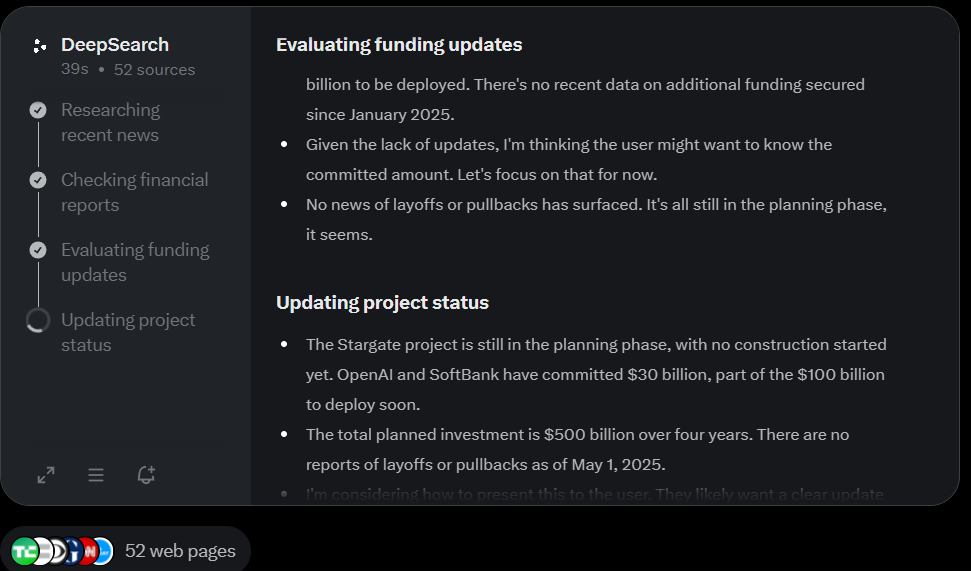

# US Investment Tracker

This document provides an overview of the investment data stored in the JSON file, detailing the structure, fields, and their meanings. The data was generated using DeepResearch capabilities from large language models (LLMs), such as Grok.

## Data Overview

The JSON file contains a collection of records representing investment commitments by various companies in the United States as listed from the [whitehouse.gov](https://www.whitehouse.gov/investments/) page. Each record details a company's investment plans, including the committed amount, realized investment, sector, focus, status, and sources. The data was compiled using DeepResearch, an advanced feature of LLMs like Grok, which iteratively searches the web and analyzes information to provide accurate and comprehensive responses.

## Data Fields

The JSON structure consists of an array of objects, where each object represents a single company's investment commitment. The fields for each record are as follows:

| Field        | Type             | Description                                                                                                                       |
| ------------ | ---------------- | --------------------------------------------------------------------------------------------------------------------------------- |
| `company`    | String           | The name of the company or group of companies making the investment.                                                              |
| `investment` | Number           | The total committed investment amount in thousands of USD (e.g., 500,000,000 for $500 billion).                                   |
| `sector`     | String           | The industry sector of the investment (e.g., Technology & AI, Pharmaceuticals & Biotech).                                         |
| `focus`      | String           | The specific area or purpose of the investment (e.g., AI infrastructure, Manufacturing expansion).                                |
| `progress`   | Number           | The realized investment amount in thousands of USD (i.e., the amount already invested). If not specified or zero, it is set to 0. |
| `status`     | String           | The current status of the investment (e.g., In Progress, Announced, Layoffs, Pullback, Complete).                                 |
| `summary`    | String           | A detailed description of the investment, including realized investment, timelines, job creation, and any layoffs or pullbacks.   |
| `sources`    | Array of Strings | A list of URLs or placeholders (e.g., "No specific sources available") referencing the data sources.                              |

### Example Record

```json
{
  "company": "Softbank, OpenAI, and Oracle",
  "investment": 500000000,
  "sector": "Technology & AI",
  "focus": "AI infrastructure (Project Stargate)",
  "progress": 100000000,
  "status": "In Progress",
  "summary": "Realized Investment: $100 billion (initial deployment for data center construction in Texas, expected to create 100,000 jobs). Construction underway, announced January 2025. No layoffs or pullbacks reported.",
  "sources": [
    "https://www.whitehouse.gov/articles/2025/03/more-investment-more-jobs-and-more-money-in-americans-pockets/",
    "https://group.softbank/en/news/press/20250122",
    "https://www.cnn.com/2025/01/21/tech/openai-oracle-softbank-trump-ai-investment/index.html"
  ]
}
```

## Data Generation Process

The data was generated using the DeepResearch mode of an LLM, such as Grok, created by xAI. DeepResearch involves iterative web searches and analysis to extract relevant information from publicly available sources. The process included:

1. **Data Extraction**: Parsing the provided HTML table containing investment details, including company names, investment amounts, sectors, and summaries.
2. **Transformation**: Converting investment and realized investment amounts into thousands of USD (e.g., $500 billion to 500,000,000). The progress field was set to the realized investment amount, using 0 for unspecified or zero values.
3. **Validation**: Ensuring all text is in English and correcting any anomalies (e.g., removing erroneous non-English phrases).
4. **Source Compilation**: Including URLs from the table's source lists or noting "No specific sources available" when applicable.

The DeepResearch capability allowed for accurate interpretation of complex data, handling of ambiguous terms (e.g., "$2 billion+"), and consistent formatting of the output.



### Prompt

deep research prompt

    Do research on the latest for data pertaining to the companies listed to update the json. amounts are in thousands of USD

followup to update JSON

    take the learnings and put them into the same json format. The only statuses allowed are already in the original payload

## Notes

- **Investment and Progress**: The `investment` field represents the total committed amount, while `progress` reflects the actual amount invested (realized investment). For example, a $500 billion commitment with $100 billion realized is represented as `investment: 500000000` and `progress: 100000000`.
- **Sources**: Some records lack specific sources due to limited information in the original data. These are marked as "No specific sources available."
- **Accuracy**: The data is based on the provided table and processed using DeepResearch. While efforts were made to ensure accuracy, users should verify critical information with primary sources for decision-making purposes.
- **Language**: All fields are in English, with any non-English text corrected during processing.

## Usage

This JSON data can be used for:

- Analyzing investment trends across sectors (e.g., Technology & AI, Pharmaceuticals & Biotech).
- Tracking the progress of major corporate investments in the U.S.
- Researching the economic impact of investments, including job creation and regional development.
- Verifying investment details by referencing the provided sources.

## Corrections

- **Corning, Inc. Investment Increase**: The investment commitment for Corning, Inc. was updated from an initial $900 million to $1.5 billion for a solar component plant in Michigan. This change is reflected in the `investment` field (1,500,000 thousand USD) and was announced on April 29, 2025, as noted in the summary.

## Contributing

**Pull requests are free, but merges aren't guaranteed**

Feel free to add corrections. However if updating data, you must provide reasonable sources along with the updates.

### Generating the pages

Because I am lazy, I don't have a proper actions pipeline setup to just regenerate the content and add a commit to some protected branch. For now just update the data.json file and run `uv run generate_page.py`
